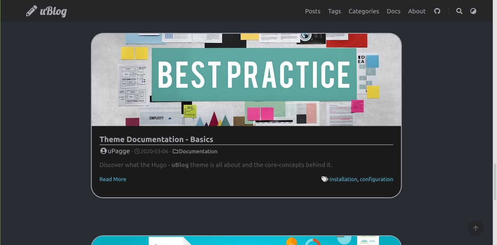
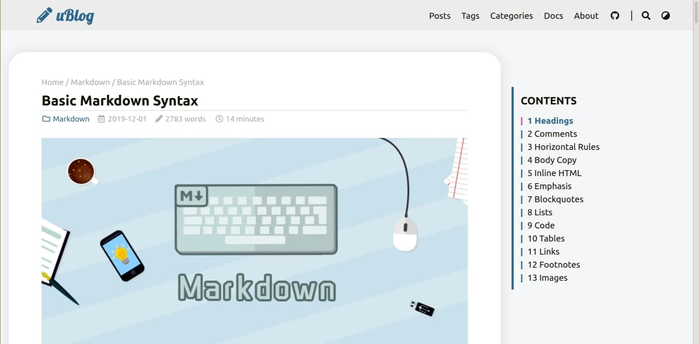
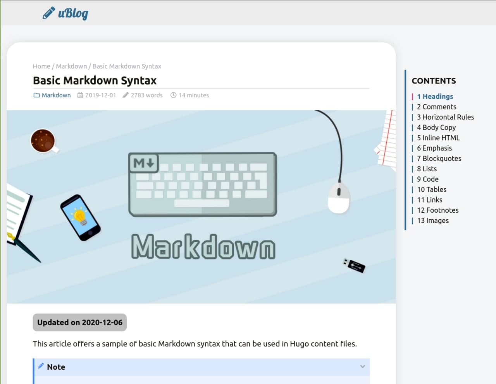
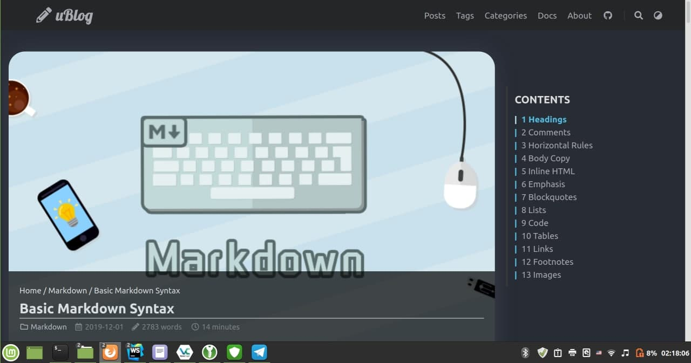
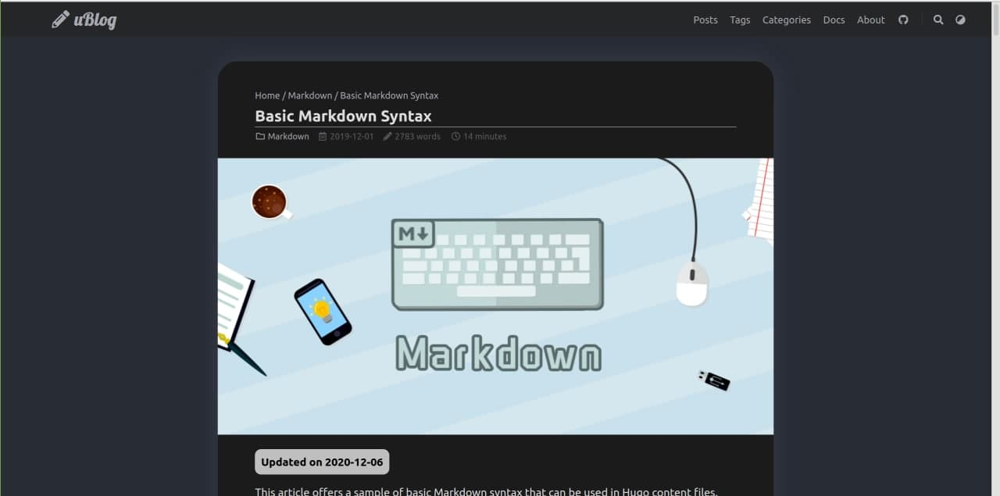
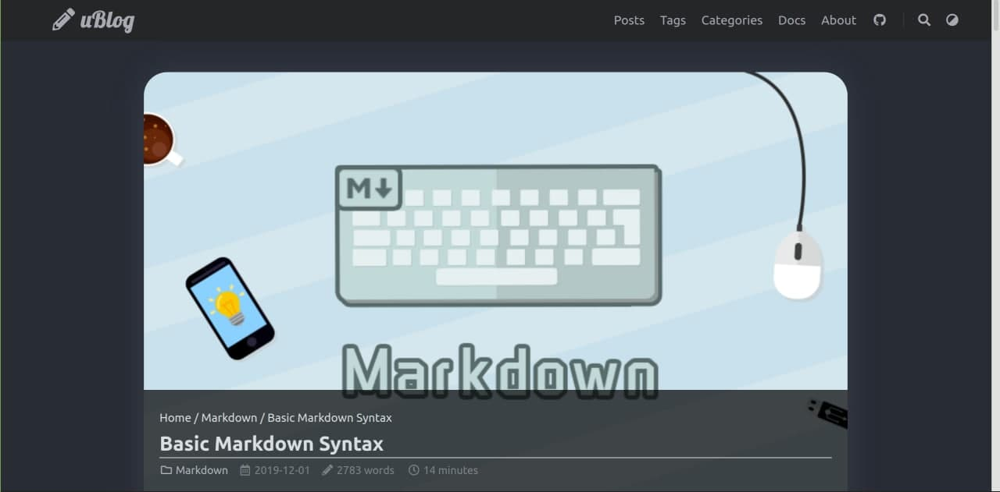
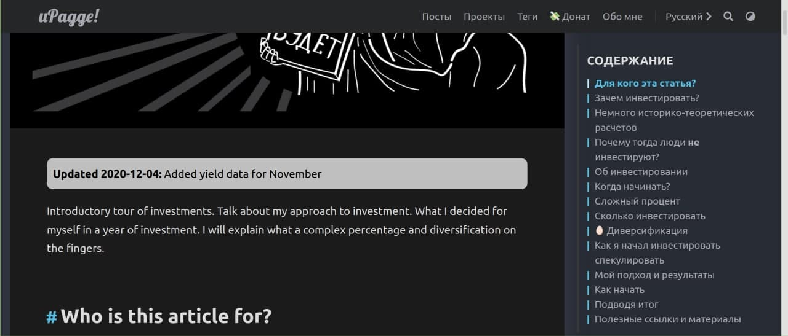
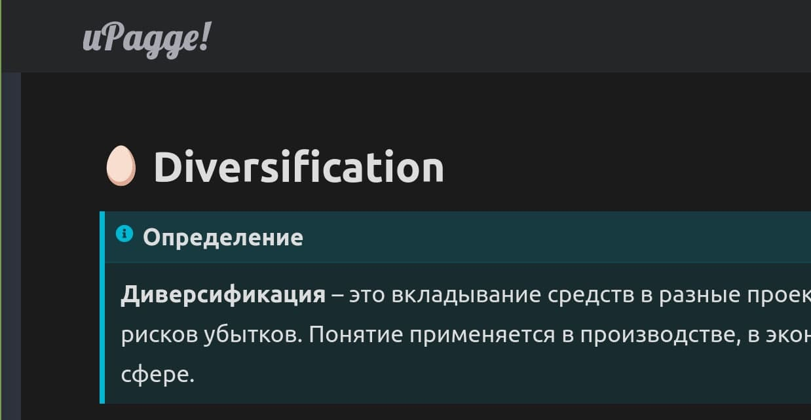

# Hello :wave:

Too bad, but the developer of LoveIt hasn't responded to my messages for many weeks, and his last activity at GitHub was in May.

I decided that I would develop the project further, but under a different brand - uBlogger. As the author of LoveIt created his project based on LeaveIt Theme and KeepIt Theme.

Now the **official language of support is English**, I have removed the version of the documentation in French and Chinese, as I do not know them, I hope you will forgive me :).

Here is a brief list of changes, more details can be found in the documentation.

The main emphasis is on the convenience of reading content, because we have a blog. So the big changes have been made in the form of posts.

## What have I managed to change

> While there is no demo site, you can see how the template looks on [my blog](https://blog.upagge.ru).

* I rethought the design of the articles and the display of the articles on the main page. 
    * Now the article page can have three views, and in combination with the positioning of content you have the flexibility to change the format of displaying the article.
        * mini post
            
        * theme post and toc enable:
            * classic
                
            * wide
                
            * full
                
        * theme and toc disable or static
            * classic
                
            * wide
                
            * full
                
    * Author's comment, according to the plan, should encourage readers to discuss.
        
    * Counter of comments to the article. Available from Remark42 only.
    * Changing the mechanism for reporting article updates
        
    * Disabling characters in headers, allows e.g. using smileys instead of '#'.
        
    * Big changes at the bottom of the article
        
        * New display of the author of the article.
        * New type of buttons to share
        * Changed the navigation type between next and previous article
        * New way to display article tags
* I took the changes in their PRs that fixed the bugs: [#558](https://github.com/dillonzq/LoveIt/pull/558/files), [#544](https://github.com/dillonzq/LoveIt/pull/544/files), [#522](https://github.com/dillonzq/LoveIt/pull/522), [#521](https://github.com/dillonzq/LoveIt/pull/521), [#519](https://github.com/dillonzq/LoveIt/pull/519), [#461](https://github.com/dillonzq/LoveIt/pull/461/files), [#433](https://github.com/dillonzq/LoveIt/pull/433/files), [#425](https://github.com/dillonzq/LoveIt/pull/425)
* Added breadcrumbs support for OpenGraph
* Support for [Remark 42](https://github.com/umputun/remark42/) comments. Ooo is a great project and I strongly recommend using this commenting system for your site. Soon I will write an article why it is the best commenting system and how to set it up. Personally, I use it in [my blog](https://blog.upagge.ru).
* Added support for [yandex metrics](http://metrika.yandex.com/)
* I also made a lot of small improvements, and this is just the beginning :smile:

If you have ideas or suggestions, or if you find bugs, please report them to the [issue](https://github.com/uPagge/uBlogger/issues).

**If you liked the topic, I would be glad if you gave a :star2: star to this project. Well, either throw me a coffee via [PayPal](https://paypal.me/upagge)**

### Change the markdown design

1. The `em` tag is no longer slanted, it is now a marker selection.

2. The quote is no longer a quote, but a focus on important aspects.
